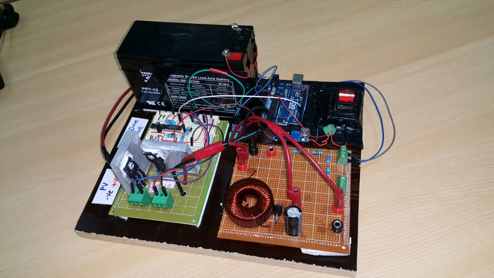

# Introduction

This hunk of wires and circuitery was affectionaly christened **Ra'd** (*thunder in Arabic*) for his sparky and somewhat mercurial behaviour (wasn't breastfed as a child you see).
Went through three **Arduinos** and much heartache, but in the end we managed to tame him.

The project was to build a **Maximum Power Point Tracker (MPPT)** to interface between a solar panel and an electrical load. For the layman, all solar panels have the following power characteristics (shown in red on the graph below). We build hardware to allow us to traverse across the x-axis of the graph and the software constantly monitors the power output and tries to have us reach the peak of the curve. Which in the graph would be at a voltage of 32V, a current of ~4.5A to get us 140W of power.

  

The problem we face is that this peak's location on the graph changes based on the sun's position in the sky, the ambient temperature, whether there is dust on the panels, clouds, etc... Thus we need to design an **optimization algorithm** that has us always at the peak, regardless of the conditions. A summary of the coding will be given below, for the full project report check out the docs. 

# Coding
##### Eyes and Ears
The very first step in coding something like this is to know our head from our feet. As in, we need to find our position on the graph. It's a simple enough matter, the Arduino has five analog inputs and we only need to use two. The first one will acquire the voltage of the load (using a simple voltage divider to step down the voltage to the 0-5V range) and the second will get the current through the load using a current to voltage ammeter. After that we will multiply the two together and get the current power output.

##### Arms and Hands
The MPPT we are building can be thought of as a glorified switch, and by changing the duty cycle we can shift our position on the graph. The next step is to build up the coding infrastructure to allow us to do this. Using the arduino's timers, we can set it up such that we can output the required duty cycle at a set frequency. And on the hardware side, we pipe that output to a gate driver chip to boost the signal for our MOSFET switches.

##### Brain
Last, but certainly not least, we have to set up the control station that organizes all of this. We utilized a **hill-climbing algorithm** (also known as perturb and observe). To start it off, we calculate the current voltage and power output then we increase the duty cycle by a pre-defined jump (say 5%) and then calculate the new voltage and power. After that, we calculate the delta voltage and delta power (new - old) and multiply them together. If it's positive, that means we are on the left side of the curve and we need to move right, thus we increase duty cycle. If we get a negative, that means we are on the right side of the curve and we need to move left.

# Conclusion

   Team taking a well deserved victory lap after the project was done

